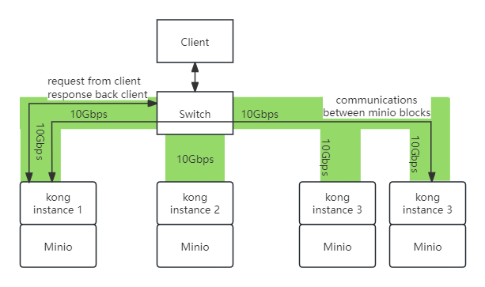
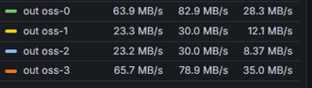
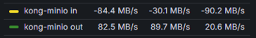
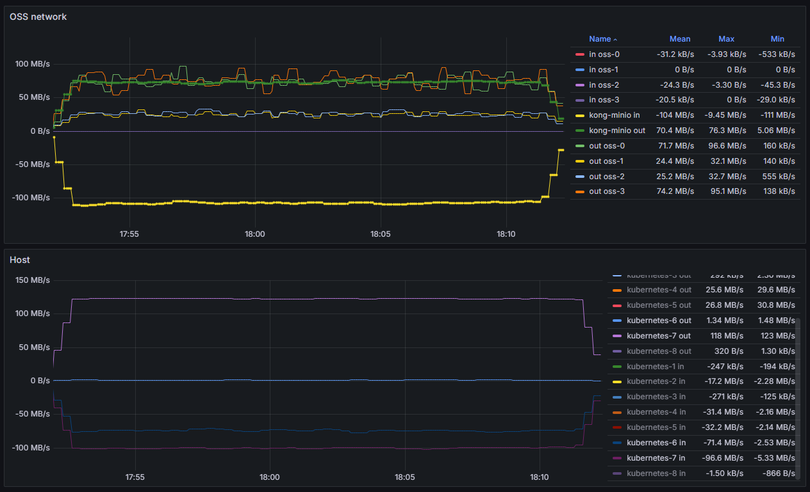
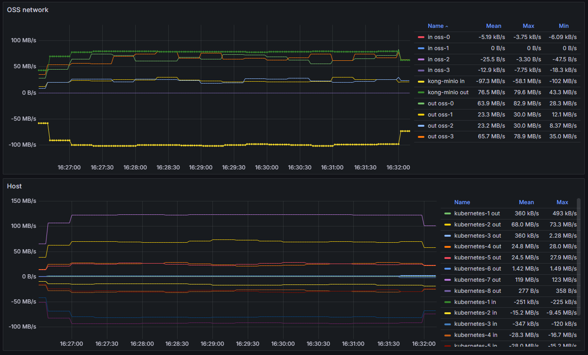
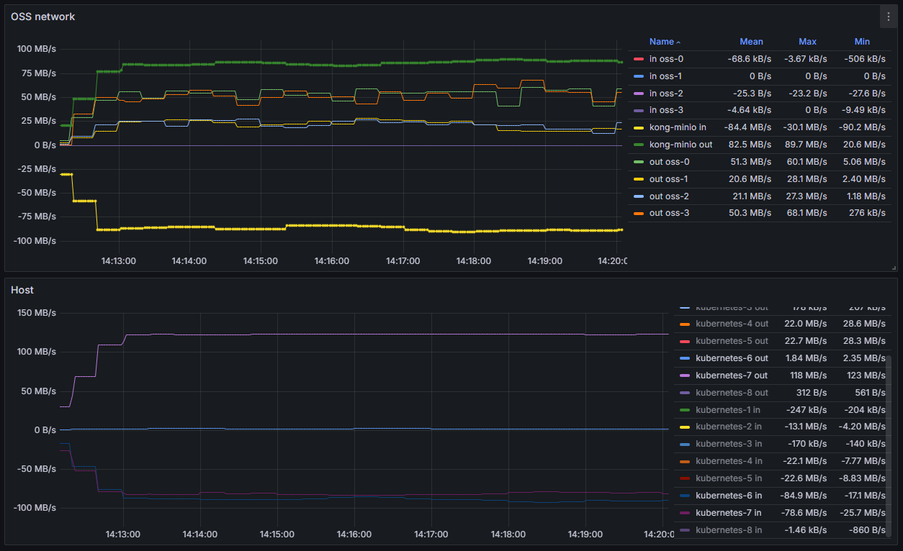
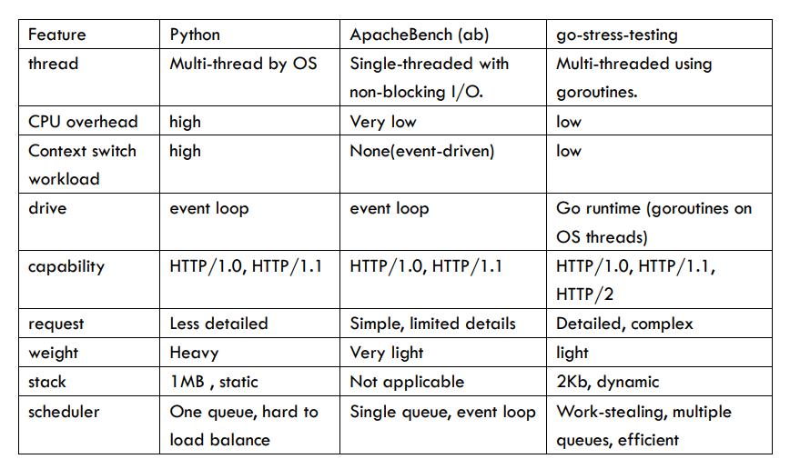

# Network Traffic Analyze OUTLINE  
 

## Current Network Configuration:  
__Diagram__:

   
   

__Monitor Notes__:
- Kong and OSS (MinIO) instances are all in their own Docker containers.
- There are four Kong instances and one virtual IP.  We are focusing on one Kong instance attached to OSS-3.   
- Kubernetes-7-out/in: Traffic through the physical network interface of the node.
- Kubernetes-6-out: Request traffic.
- Kubernetes-6-in: Actual download traffic.   
- Kong-MinIO in: Inward flow to the Kong-MinIO container
- Kong-MinIO out: Outward flow from the Kong-MinIO container     
- Other oss is under other kong instances   

There are four Kong instances, each attached to a MinIO instance. These MinIO instances can either be a data block or a parity block. In total, there are 2 data blocks and 2 parity blocks. Since a MinIO block only contains half of the data (due to EC:2), when a client request comes in, MinIOA needs to retrieve data from at least one other MinIO block. Therefore, the bandwidth of such Kong instances is not only used for responding to client requests but also for sending data from one MinIO block to another. We are curious about the proportion of the total output of a Kong instance that is used for communication between MinIO blocks. To answer this question, we set up an experiment and made calculations based on certain assumptions.  

__Objective__:    
   Determine the system's upper bounds and the proportion of Kong's outbound traffic that is dedicated to client responses.         
 
## Calculations:  
__Assumptions__:  
- Data blocks and parity blocks are evenly distributed (the statistics of each MinIO container's output are nearly the same).   
- Assume the Kong instance we pick always has half the data and only needs to take half of the data from another MinIO block.   
- There are three Kong instances, each attached to a MinIO instance.  In total, there are 2 data blocks and 1 parity block. Since a MinIO block only contains half of the data (due to EC:1), when a client request comes in, MinIOA needs to retrieve data from at least one other MinIO block. 

  
As file size, transfer speed, and time cancel out in the equation, these parameters are not critical and can be set randomly as you like. Under these assumptions, we calculate that the proportion of Kong's outbound traffic dedicated to client responses is about 3/4.  This calculation comes from considering each Kong instance's output (1 + 1 + 1) and MinIO communication (1/2 * 2).  We set up an experiment to verify our assumptions.       

## Experiment Observations:   
__Experiment Configuration__:     
   - Bandwidth: 1Gbps    (equivalent to 128MB)   
   - Filesize: 4* 500MB files   
   - Total number of requests: 900    
   - Number of concurrent connections: 30   
   - Use Stress-Testing Tools to send 900 requests all at once
    
__Observations and Discrepancies__:  
- Outbound traffic of MinIO blocks does not distribute evenly.     
        

- In some cases, the output and input flow of Kong-MinIO is not the same.      
         
          
         

__Cause of such discrepency__:    
Kong-MinIO output and input discrepancies are due to failed requests from the go-stress-testing tool. Using another stress-testing tool could resolve this problem.   
  
    
__Results__: 

Based on the monitor screenshot, as `kubernetes-6 in` represents the download file (response to the client) and `kubernetes-7 out` represents the total output of the node, with the upper device limit being 123MB, which is close to the 128MB theoretical maximum, we conclude that the results align with our calculations. The proportion of Kong's outbound traffic dedicated to client responses is approximately 85MB out of 123MB, which is close to 3/4 and slightly lower than the theoretical upper bound.   
     

## Handling Increased Traffic:   
### DNS round-robin, Gateway dual VIP:    
_Possible limitations_: 
- DNS round-robin may not distribute traffic evenly
- not possible to assign weighst to DNS entries

### Network card upgrade, 10G -> 25G：    

### Split internal and external traffic to different network cards：     

### Layer 4 load balancing : [ref](https://www.kawabangga.com/posts/5301)   

### Service optimization, optimize existing network requests.   

## Ways to Experiment: Using Stress-Testing Tools   
Comparison of Using Different Stress-Testing Tools:   

Tools to Consider:     
- python custom script       
- go-stress-testing    
- apache bench    
- jmeter

Simplified comparison version is as below image, detailed version is at comparison_of_ST_tools.md

  

